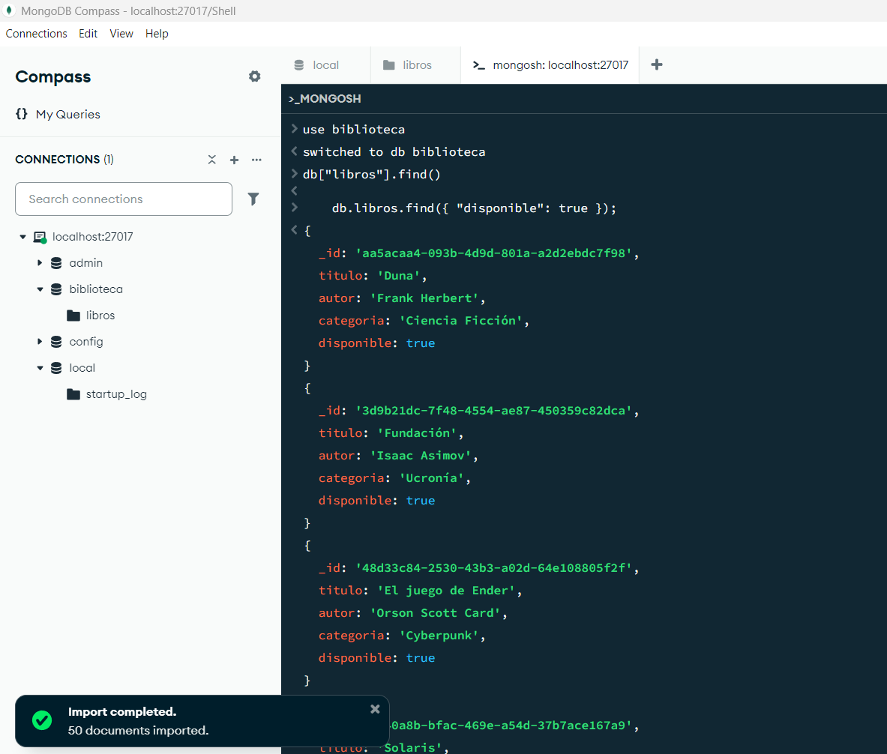
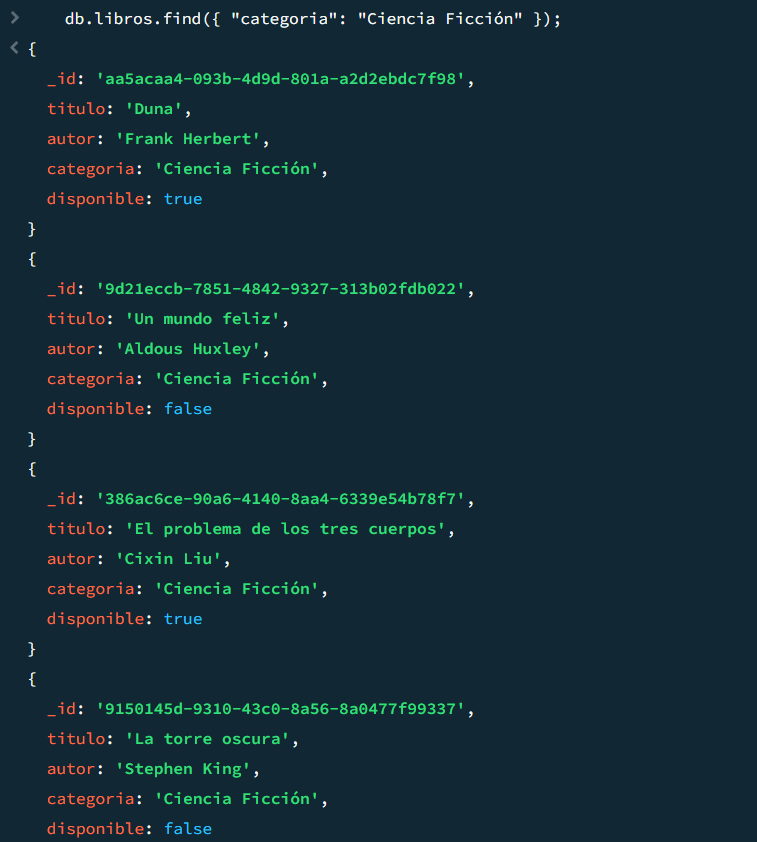
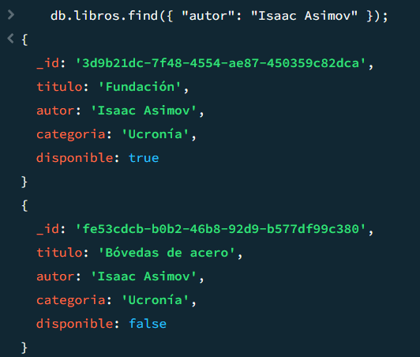
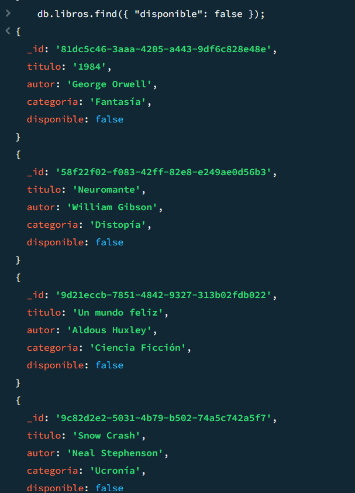
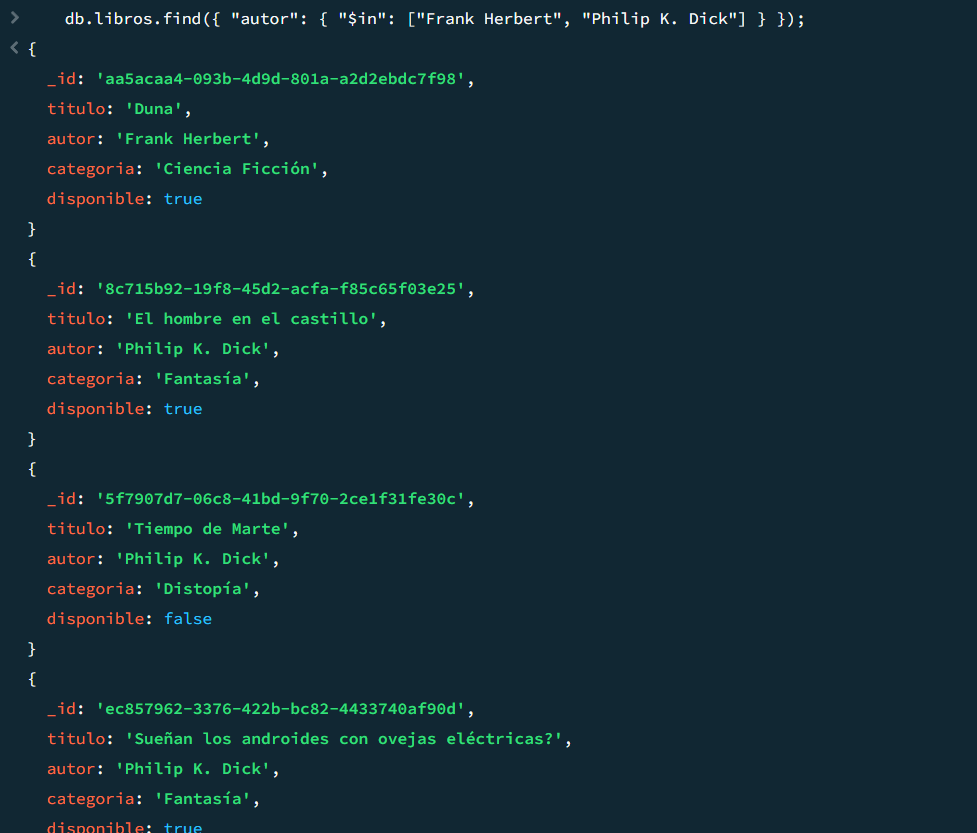
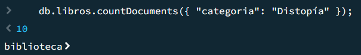
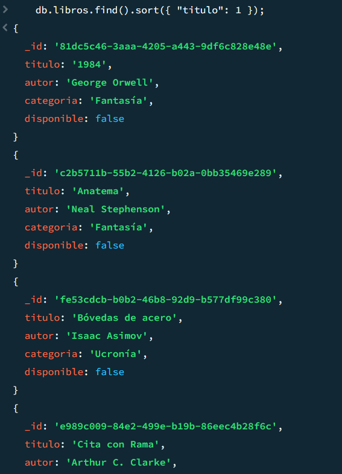
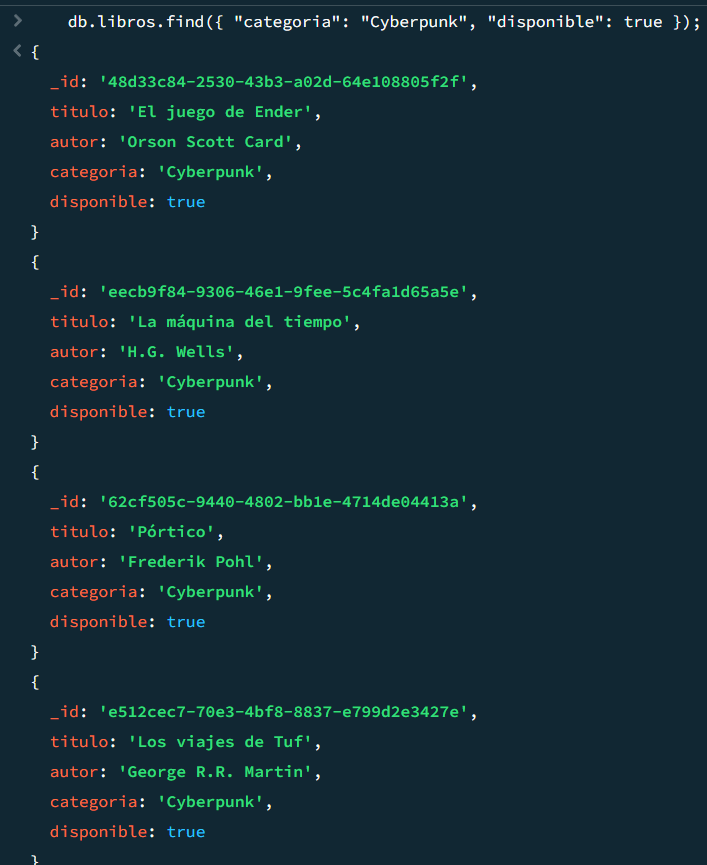
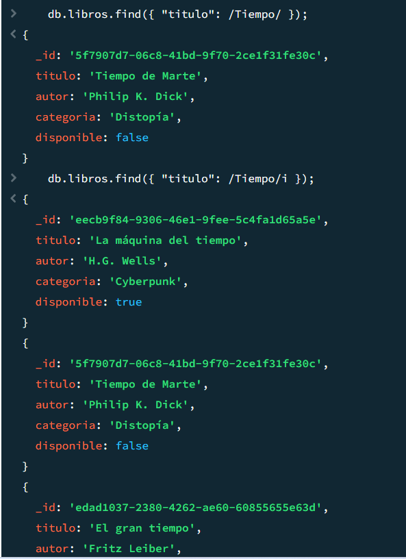
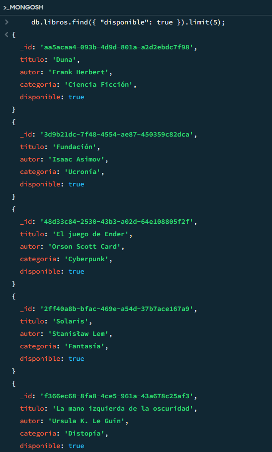

**Repo:**
https://github.com/FranciscoHernandezPuertas/AccesoADatosExamen02MongoDBConsultasBibliotecaGestorUsuarios

**Url Vercel:**
https://acceso-a-datos-examen02-mongo-db-consultas-bibliotec-r262d0b16.vercel.app/

**Las consultas están entre los paréntesis de "db.libros.find".**

**Asumimos que estamos usando la colección biblioteca con:**  
`use biblioteca`

1. **Encuentra todos los libros disponibles en la biblioteca.**  
    ```js
    db.libros.find({ "disponible": true });
    ```
    
    

2. **Obtén todos los libros que pertenecen a la categoría "Ciencia Ficción".**  
    ```js
    db.libros.find({ "categoria": "Ciencia Ficción" });
    ```
    
    

3. **Encuentra todos los libros escritos por "Isaac Asimov".**  
    ```js
    db.libros.find({ "autor": "Isaac Asimov" });
    ```
    
    

4. **Filtra los libros que no están disponibles para préstamo.**  
    ```js
    db.libros.find({ "disponible": false });
    ```
    
    

5. **Encuentra todos los libros escritos por "Frank Herbert" o "Philip K. Dick".**  
    ```js
    db.libros.find({ "autor": { "$in": ["Frank Herbert", "Philip K. Dick"] } });
    ```
    
    

6. **Cuenta cuántos libros hay en la categoría "Distopía".**  
    ```js
    db.libros.countDocuments({ "categoria": "Distopía" });
    ```
    
    

7. **Muestra los libros ordenados alfabéticamente por título.**  
    ```js
    db.libros.find().sort({ "titulo": 1 });
    ```
    
    

8. **Encuentra todos los libros de la categoría "Cyberpunk" que estén disponibles.**  
    ```js
    db.libros.find({ "categoria": "Cyberpunk", "disponible": true });
    ```
    
    

9. **Encuentra todos los libros cuyo título contenga la palabra "Tiempo".**  
    ```js
    db.libros.find({ "titulo": /Tiempo/ });
    ```
    **En caso de querer ignorar mayúsculas y minúsculas:**
    ```js
    db.libros.find({ "titulo": /Tiempo/i });
    ```
    
    

10. **Obtén los primeros 5 libros disponibles en la colección.**  
     ```js
     db.libros.find({ "disponible": true }).limit(5);
     ```
     
     