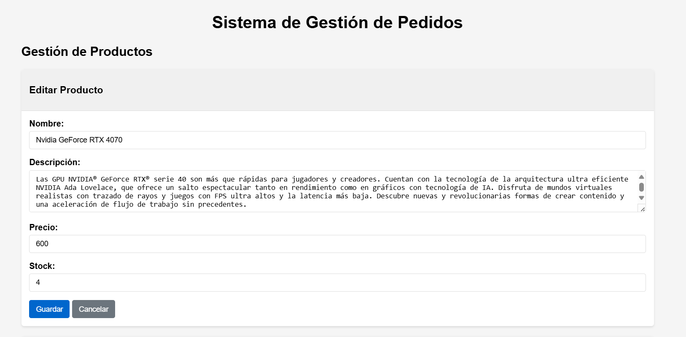

# Gestión Usuarios

## 1. Productos

### 1.1 Añadir Productos

### 1.2 Editar Productos

**Al seleccionar el botón de editar, se rellenan los datos en el menú de creación:**

### 1.3 Eliminar Productos

## 2. Usuarios

### 1.1 Añadir Usuarios

### 1.2 Editar Usuarios

### 1.3 Eliminar Usuarios

#### En estos tres casos, se aplica lo mismo que en Productos, solo que más abajo en la página, y con campos distintos:

